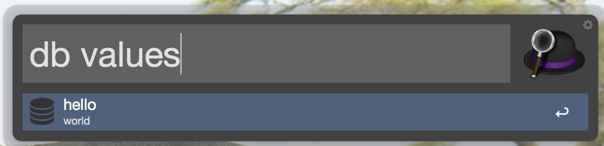

# db

* a simple key value storage.

        db save => save a value
        db get => get a value by key
        db del => delete a value by key
        db values => list key-values and copy a value to clipboard
        db keys => list key-values and copy a key to clipboard

